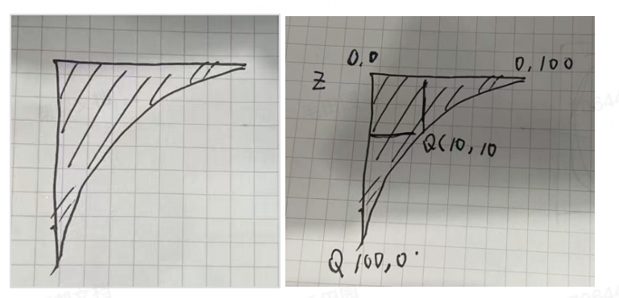

# 一、背景

由于CSS clip-path生成的路径为纯直角, 为了实现圆角效果，我们通过叠加SVG矢量图形实现视觉增强。
1. 精准匹配底层挖洞区域形状
2. 实现平滑的圆角过渡效果


# 二、实现原理

### 2.1 几何结构设计

关键特征点：

* 直角顶点：左上角(0,0)

* 垂直边：左侧边(0,0)→(0,100)

* 凹陷曲线：左下角→右上角的贝塞尔曲线

### 2.2 贝塞尔曲线原理

采用二次贝塞尔曲线(Q指令)实现凹陷圆角：

```plain
Q(controlX, controlY, endX, endY)
```
控制点计算规则：
```plain
  控制点
   / \
  /   ↘
起点    终点
```
* 控制点决定曲线弯曲程度

* 控制点与起点/终点的距离决定曲率半径

# 三、具体实现

### 3.1 路径算法

```plain
// 尺寸与圆角比例系数
const RADIUS_RATIO = 0.2; 


private get pathData() {
  const size = this.size;
  const radius = size * RADIUS_RATIO;
  
  return `
    M 0 0
    L 0 ${size} 
    Q ${radius} ${size - radius}, ${size} 0 
    L 0 0 Z
  `;
}
```


```plain
M 0 0            // 起点：左上角
L 0 ${size}      // 绘制垂直边到底部
Q ${cx} ${cy}    // 控制点坐标
  ${size} 0      // 曲线终点：右上角
L 0 0 Z          // 闭合路径
```
### 3.2 动态控制点

根据尺寸动态计算控制点：

```plain
           size
        +----------+
        |         /
        |        /
        |       / 
radius  |      /  
        | 控制点●
        |   /
        |  /
        | /
        +
```
* 控制点X坐标：radius = size * 0.2

* 控制点Y坐标：size - radius

* 数学关系：形成45度切线，保证曲线平滑度

### 3.3 组件封装

```json
import { Component, Prop, Vue } from 'vue-property-decorator';


export const CURVED_EDGE_TRIANGLE_POS = [
  'left-top',
  'left-bottom',
  'right-top',
  'right-bottom',
];


@Component
export default class CurvedEdgeTriangle extends Vue {
  // 颜色属性
  @Prop({ default: '' }) public readonly color!: string;


  // 尺寸属性
  @Prop({ default: 100 }) public readonly size!: number;


  private get pathData() {
    const pointerSize = this.size * 0.1;
    return `M 0 0 L 0 ${this.size} Q ${pointerSize} ${pointerSize}, ${this.size} 0 L 0 0 Z`;
  }


  private render() {
    return (
      <svg
        width = {this.size}
        height = {this.size}
      >
        <path d={this.pathData} fill={this.color} stroke='none'
      />
      </svg >
    );
  }
}


```